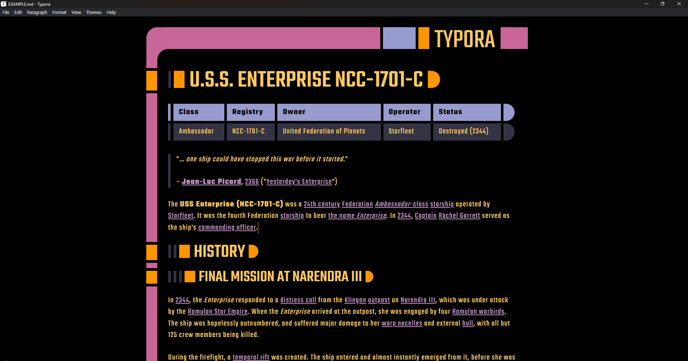
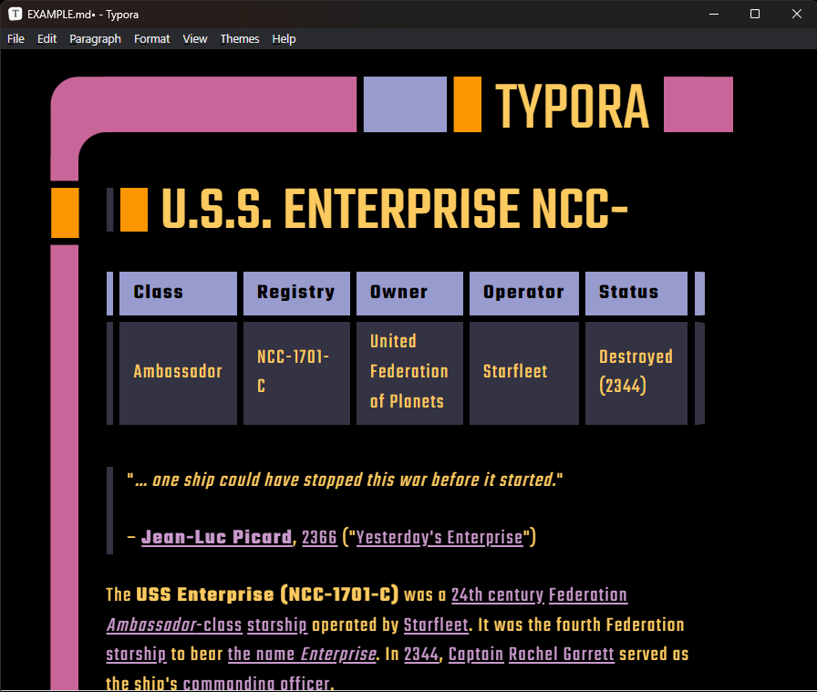

# LCARS

Designed by [Michael Okuda](https://memory-alpha.fandom.com/wiki/Michael_Okuda) for [Star Trek: The Next Generation](https://memory-alpha.fandom.com/wiki/Star_Trek:_The_Next_Generation), the **Library Computer Access** and **Retrieval System** (**LCARS** for short) operating system design is an iconic part of the aesthetic of "New Trek". 

With this Typora theme, you can feel like a bridge officer aboard the Enterprise as you edit your Markdown files.

> Make it so!
>
> \- [Cpt. Jean Luc Picard](https://memory-alpha.fandom.com/wiki/Jean-Luc_Picard)

## Screenshots

## How to install

Download the .css file for the latest release from GitHub, then copy the contained CSS file to your Typora themes folder.